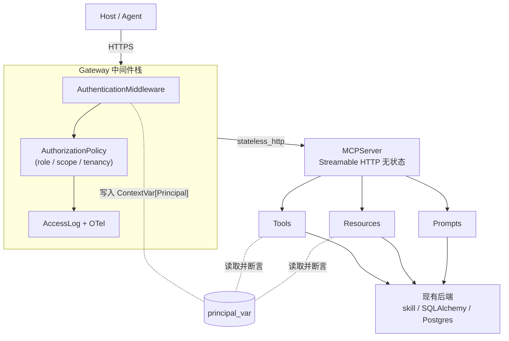

# Coursepilot MCP 层重构设计（从零设计 v1）

> 状态：方案设计（实施中）——P1-T1 已完成（2026-08-10），P1-T2/T3 待启动，详见 `docs/MCP_重构_TODO.md`
> 更新：2026-08-10
> 背景：现有 MCP 层存在 P0 越权（租户隔离缺失）、P1 弃用传输（SSE）与私有内部依赖、P2 鉴权硬化与可观测缺失。本设计在不动现有业务逻辑（skill / SQLAlchemy / Postgres）的前提下，从零重画 MCP 服务层架构，把"身份（Principal）"作为一等公民。
> 实施前提：本设计基于已安装的 `mcp` 2.0.0 稳定版实地核验（见 [§11](#十一已验证的技术事实避免幻觉)），不依赖任何私有 API 假设。

## 本期范围（明确边界）

- **本期设计覆盖**：网关鉴权/授权分层、Principal 注入机制、目录结构重整、传输去债（去 SSE / 去私有依赖）、OTel 可观测基础、安全补充。
- **暂缓（明确不在本期）**：
  - OAuth 2.1 + PKCE + DPoP 生产鉴权适配 —— 仅预留 `auth/middleware.py` 替换点，不在本期落地（见 [§9](#九分阶段实施路线) P4）。
  - MCP Apps（富 UI）/ Tasks（长任务）扩展 —— 当前 8 工具无长任务/富 UI 需求，架构已留 `policy` / `observability` 扩展点，挂起。
  - 多实例 key 轮换（进程外存储）—— 单实例约束下用进程内字典，挂起（见 [§10](#十风险与未决点)）。

---

## 目录

1. [现状问题回顾](#一现状问题回顾)
2. [设计目标与硬约束](#二设计目标与硬约束)
3. [目标架构](#三目标架构)
4. [核心机制：Principal 注入（P0 落地根）](#四核心机制principal-注入p0-落地根)
5. [目标目录结构](#五目标目录结构)
6. [鉴权 / 授权分层](#六鉴权--授权分层)
7. [传输与网关去债](#七传输与网关去债)
8. [可观测（OTel）](#八可观测otel)
9. [分阶段实施路线](#九分阶段实施路线)
10. [风险与未决点](#十风险与未决点)
11. [已验证的技术事实（避免幻觉）](#十一已验证的技术事实避免幻觉)

---

## 一、现状问题回顾

基于对现有代码的审查（非泛泛而谈），当前 MCP 层已做对的部分与欠账如下。

### 已做对的（保留，不破坏）

| 项 | 位置 | 评价 |
|---|---|---|
| 无状态 Streamable HTTP 已落地 | `gateway/main.py` `stateless_http=True` + `json_response=True` | 领先于 2026-07-28 无状态规范方向，保留 |
| 工具描述"API 文档式" | `server.py` `[1-用途]…[6-输出格式]` | 企业级最高 ROI 实践（误调用 23%→<5%），强项 |
| `ToolAnnotations` 正确设置 | `server.py` `read_only_hint` / `destructive_hint` | 准确，保留 |
| Resource URI 规范 | `course://` `student://` | 符合规范，保留 |
| stdio→HTTPS 桥接器 | `cli/main.py` | UTF-8 处理 / 日志走 stderr / 错误映射，实现质量高 |
| 访问日志隐私意识 | `gateway/main.py` 只记 key 前缀 + tool 名 | 符合 R4.9 日志脱敏 |

### 欠账（按严重度）

- **P0 鉴权越权 / 租户隔离缺失**：网关中间件算出了 `ApiKeyInfo(user_id, role)`，但**只用于访问日志，从未注入 MCP 请求上下文**；工具把客户端传入的 `user_id` 原样透传给 skill；`user_id` 仅校验 UUID 格式、不校验"是否等于当前登录用户"。任何持有 key 的调用方传 `user_id="u-002"` 即可读任意学生数据。
- **P1 残留已弃用 SSE 传输**：`gateway/main.py` 仍挂载 `sse_app`，攻击面 + 维护负担。
- **P1 访问私有内部**：`gateway/main.py` `getattr(mcp._lowlevel_server, "_session_manager", None)` 访问双下划线私有属性。注：实测（mcp 2.0.0）无状态模式同样需要 `session_manager.run()` 初始化 task group，故该访问"并非形同虚设"，但正确姿势是直接挂 SDK 返回的 app 用自带 lifespan，从根上消除私有访问（见 §7）。
- **P2 静态 key 鉴权**：无过期、无轮换、无 per-tool scope；`role` 只记日志未强制。
- **P2 无工具调用追踪**：仅有访问日志，无分布式 trace。

---

## 二、设计目标与硬约束

**目标**：一个企业级、可水平扩展、安全边界清晰的 MCP 服务层，修掉 P0/P1/P2 并补可观测。

**必须服从的真实约束（来自项目现状）**：

- 单实例部署；FastAPI + SQLAlchemy(async) + PostgreSQL 16；docker-compose 仅起 Postgres，**无 Redis、无消息队列**。
- 已装 `mcp` 2.0.0 稳定版，传输层已走在无状态 Streamable HTTP 方向。
- 不引入新基础设施（Redis / 网关集群）；鉴权状态用进程内 + 数据库，不依赖分布式会话。

**设计假设（如不符请指出）**：保留 `coursepilot-mcp` stdio 桥接器；远程只走 Gateway；租户模型为 `user_id` + `role(student/teacher/super)`。

---

## 三、目标架构



**一句话**：Host 经 HTTPS 进入 Gateway（Authentication → AuthorizationPolicy → AccessLog/OTel），挂载无状态 MCPServer，工具/资源在处理时从 `ContextVar[Principal]` 读取调用方身份做租户断言。

---

## 四、核心机制：Principal 注入（P0 落地根）

P0 根因是"网关算出了身份却没传给工具"。2.0.0 已提供官方底座（`AuthContextMiddleware` + `Context`），但最干净、最自控的做法是**自持一个 `ContextVar[Principal]`**：网关鉴权后写入，工具/资源在同一 task 上下文内读取并断言。零私有依赖、零 body 解析。

### 4.1 `mcp/principal.py`（新增）

```python
# src/coursepilot/mcp/principal.py
from contextvars import ContextVar
from dataclasses import dataclass

@dataclass(frozen=True)
class Principal:
    user_id: str
    role: str                 # student | teacher | super
    scopes: frozenset[str]

principal_var: ContextVar[Principal | None] = ContextVar("cp_principal", default=None)

def get_principal() -> Principal:
    p = principal_var.get()
    if p is None:
        raise UnauthenticatedError()   # 未走网关直连，拒绝
    return p
```

### 4.2 `mcp/auth/policy.py`（新增授权层）

用装饰器统一做租户断言，避免 8 个工具各写一遍：

```python
# src/coursepilot/mcp/auth/policy.py
def require_self_or_privileged(*privileged_roles):
    def deco(fn):
        async def wrapper(params, *a, **k):
            p = get_principal()
            uid = str(getattr(params, "user_id", None) or "")
            if p.role not in privileged_roles and uid and uid != p.user_id:
                raise ToolForbiddenError("无权访问该用户数据")
            return await fn(params, *a, **k)
        return wrapper
    return deco

# 用法
@require_self_or_privileged("teacher", "super")
async def diagnose(params: DiagnoseParams) -> CallToolResult: ...
```

`resources/course.py` 的 `read_report` / `read_mastery` 同样在入口做 `user_id` 作用域校验。这样 `auth.py` 注释里"学生只能查自己"从**谎言变成真实代码**。

> **备用路径（已验证可用）**：若 `ContextVar` 跨 SDK 内部 task 边界透传失败，回退到"网关注入 `X-Principal-User-Id` / `X-Principal-Role` 请求头，工具从 `ctx.headers` 读取"。`Context.headers` / `ctx.transport.headers` 在 2.0.0 中已确认可访问（见 §11）。

---

## 五、目标目录结构

```
src/coursepilot/mcp/
├── server.py              # MCPServer 实例 + 注册 resources/prompts/tools（结构保留）
├── principal.py           # Principal + principal_var + get_principal()           【新增】
├── auth/
│   ├── middleware.py      # AuthenticationMiddleware（API Key / OAuth 可插拔）   【替代 auth.py】
│   ├── policy.py          # AuthorizationPolicy + require_self_or_privileged / require_scope 【新增】
│   └── keys.py            # KeyStore：启动时载入、支持轮换、不每次请求读 env      【替代 auth.py 部分】
├── gateway/
│   ├── app.py             # create_app()：中间件栈 + 挂载 streamable_http_app(stateless) 【替代 main.py】
│   └── observability.py   # OTel 工具 span + 访问日志（合并现有逻辑）            【新增拆分】
├── cli/main.py            # stdio→HTTPS 桥接（实现已好，基本保留）
├── tools/{tutor,practice,knowledge}.py   # 加租户断言装饰器
├── resources/course.py    # 加 user_id 作用域校验
├── prompts/...            # 保留
└── shared/{schemas,errors}.py            # Pydantic 参数 + 描述模板约定 + 统一错误
```

**与现有文件映射**：

| 现有文件 | 重构后 |
|---|---|
| `gateway/main.py` | 拆为 `gateway/app.py`（删 SSE、`_lifespan` 私有访问）+ `observability.py` |
| `gateway/auth.py` | 拆为 `auth/middleware.py` + `auth/keys.py` + `auth/policy.py`（新增授权层） |
| `server.py` / `tools/*` / `resources/*` | 保留，仅加断言；工具描述风格不动 |

---

## 六、鉴权 / 授权分层

这是"企业级"的分水岭：把 Authentication、Authorization、Tenancy 三层解耦。

| 层 | 职责 | 现状缺口 | 重构后 |
|---|---|---|---|
| **Authentication** | "你是谁" | 静态 key，每次请求读 env | `keys.py` 启动载入；MVP 验 `Bearer cp_xxx`，生产可换 OAuth 2.1+PKCE+DPoP（**只换 `auth/middleware.py` 内部，工具层零改动**） |
| **Authorization** | "你能干什么" | role 只记日志、无强制 | `policy.py` 集中定义 `role → scopes → tools`；`require_scope("write")` 限制 `generate_practice` / `get_review_plan` |
| **Tenancy** | "你能看谁的数据" | **完全缺失（P0）** | `require_self_or_privileged` 统一断言 |

**关键收益**：OAuth 与租户逻辑解耦——未来上 OAuth 只需替换 `auth/middleware.py` 的校验函数，工具/资源/策略全部不动。

---

## 七、传输与网关去债

- **只保留 Stateless Streamable HTTP**：`streamable_http_app(stateless_http=True, json_response=True)`，移除 `gateway/main.py` 的 `sse_app(/sse)` 与 `/messages/`。2026-07-28 已弃用 SSE，留它是攻击面 + 维护负担。
- **删除 `_lifespan` 里的 `mcp._lowlevel_server._session_manager`**（双下划线私有）。实测（mcp 2.0.0）修正：无状态模式同样依赖 `session_manager.run()` 初始化 task group（`_handle_request` 首行检查 `_task_group`），不能"干脆不挂"。正确姿势是**直接用 SDK 返回的 Starlette app（自带 `lifespan=session_manager.run`）**，不再合并 routes 到 FastAPI，从而删除手动 lifespan 与私有访问。
- **头路由（2.0 新能力）**：`GatewayMiddleware` 审计时优先读 `MCP-Protocol-Version` / `Mcp-Method` / `Mcp-Name` 头，body 解析仅兜底——比现在"解析 body 再重放"更稳更安全。

---

## 八、可观测（OTel）

`AccessLog` 已有（延迟/状态/tool 名，脱敏），新增：

- 每 `tools/call` 一个 span，`gen_ai.tool.name` / `mcp.server.url` 打标，从 `Context` 继承 W3C Traceparent（2.0 规范强制）。
- 与现有 `observability/metrics.py` **分层并存**：后者是业务统计（会话/token/成本），前者是工程 tracing，互不污染。
- 栈：OTel SDK → Collector → Jaeger/Tempo（trace）+ Prometheus/Grafana（metrics）。

---

## 九、分阶段实施路线

| 阶段 | 内容 | 工期 | 产出 |
|---|---|---|---|
| **P1 安全收口** | `principal.py` + `auth/{middleware,keys,policy}.py` + 3 工具/2 资源加断言；去 SSE、去私有依赖；清理过时测试 `tests/unit/test_mcp.py` | 1–2 天 | 越权关闭，传输干净 |
| **P2 鉴权硬化** | key 启动载入 + 轮换；`role→scope` 强制；头路由审计 | 2–3 天 | 授权真实生效 |
| **P3 可观测** | OTel 工具 span；返回内容注入标注 | 1–2 天 | 工程 tracing 上线 |
| **P4 生产 auth** | OAuth 2.1+PKCE+DPoP 适配（仅换 `auth/middleware.py`） | 按需 | 达到生产鉴权标准 |

---

## 十、风险与未决点

1. **`ContextVar` 透传依赖 SDK 在同一 task 内调用工具**——已确认 `MCPServer` 的 `Context` 机制存在，但 `ContextVar` 跨 SDK 内部 task 边界的传递需写一个最小集成测试验证（P1 第一步就跑通它；失败则回退到 §4.2 的 `X-Principal-*` 请求头备用路径，经 `ctx.headers` 读取，该属性已实测存在）。
2. **单实例约束**：`keys.py` 用进程内字典，轮换需重启或加 `/reload` 端点；若未来多实例，key 表应移入 Postgres（项目已有）。
3. **MCP Apps / Tasks 扩展**：当前无需求，架构已留 `policy` / `observability` 扩展点，不在本期范围。

---

## 十一、已验证的技术事实（避免幻觉）

以下结论均用项目已安装的 `mcp` 2.0.0 实地核验（import / introspect / 端到端请求），非检索快照推断：

- `mcp` 实测版本 `2.0.0`（`importlib.metadata.version("mcp")`，稳定版，`uv.lock` 锁定 `>=2.0.0`）。
- `from mcp.server import MCPServer` 导入成功；`MCPServer` 实例具备 `tool` / `resource` / `prompt` / `streamable_http_app` / `sse_app` / `run` / `list_tools` / `read_resource` 等属性（已实测实例级 `hasattr` 全为 True）。
- `streamable_http_app(*, streamable_http_path, json_response, stateless_http, event_store, retry_interval, max_request_body_size, transport_security, host)` 签名真实存在；`stateless_http=True, json_response=True` 组合可用。
- `mcp` 2.0.0 自带 `AuthContextMiddleware`，真实位置为 **`mcp.server.auth.middleware.auth_context`**（子模块），`auth_context_var` / `AuthenticatedUser` 同在此处导出；`mcp.server.auth.middleware` 顶层**没有**该名字（顶层只导出 `auth_context` 模块本身）。用法：在 `AuthenticationMiddleware` 之后挂载，读取 `scope["user"]` 写入 `auth_context_var`。
- 工具可声明 `ctx: Context` 参数由 SDK 注入（`Tool` 内部经 `find_context_parameter` 识别）；**`Context.request_context` 属性不存在**（旧设计/旧文档说法），真实可用的是 `Context.headers` 与 `ctx.transport.headers`（`TransportContext.headers: Mapping[str, str] | None`，`mcp.shared.transport_context.TransportContext`）——备用路径以此为准。
- **无状态模式同样需要 session manager 运行**：`StreamableHTTPSessionManager._handle_request` 首行检查 `self._task_group`（`RuntimeError: Task group is not initialized. Make sure to use run().`）；`streamable_http_app` 返回的 Starlette app 自带 `lifespan=lambda app: session_manager.run()`，故**直接挂载 SDK 返回的 app 即可，不应合并 routes 后另写手动 lifespan**。
- `sse_app` 在 SDK 2.0.0 中仍存在（未删除，SDK 侧无 deprecation 装饰器），但按 MCP 2026-07-28 规范已弃用，项目侧列为待清理项（TODO P1-T3）。
- `MCPServer` 实例存在 `_lowlevel_server`（`mcp.server.lowlevel.server.Server`）且 `streamable_http_app` 调用后其上有 `_session_manager`——这是当前 `gateway/main.py` 能取到的原因，但属私有 API，重构时消除。
- **测试现状（2026-08-10 实测）**：`tests/test_mcp/`（gateway / auth / stdio / cli / import / schemas / validation / errors）全部通过；`tests/unit/test_mcp.py` 9 个用例整体失败——其测试的是 MCP 重构前的旧 API（位置参数签名、`student_report` / `query_mastery` / `diagnose_weakness` 等已删除函数），已标记 skip 待重写或删除（见 TODO）。
- 注：上一轮对话中"Python SDK 还是 beta、不会解析到 2.0"的结论已过时——`2.0.0 final` 已发布，本项目确在 2.0 线上。
