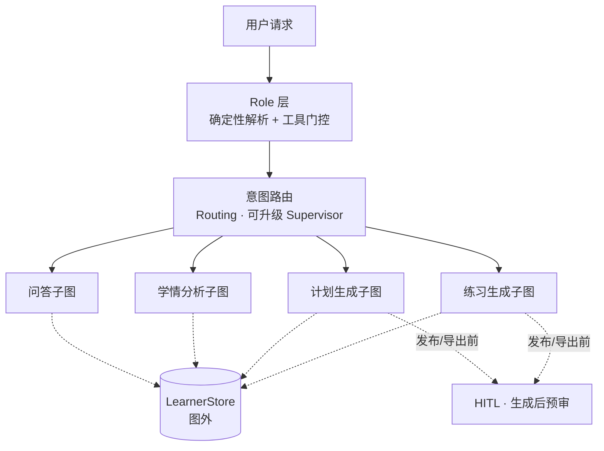

# CoursePilot 编排层重构方案

## 1. 编排层现状问题

| # | 问题 | 位置 | 影响 |
|---|---|---|---|
| 1 | 扁平单图 13 节点，四技能（问答/学情/计划/练习）无边界 | `agent/graph.py:70-148` | 技能逻辑耦合，改一处牵动全局 |
| 2 | `AgentState` 30+ 字段扁平共享，无运行时校验 | `agent/state.py:9-76` | 字段耦合、误写静默走默认分支 |
| 3 | `finalize_node` 单一函数 9 项职责（guardrails/audit/写 QA/更新会话/压缩/诊断落库/画像更新/L3 抽取/embedding） | `agent/nodes.py:131-309` | 上帝节点，任何改动都要动它 |
| 4 | 人工审批按 intent 拦截学生自学习，位置在生成前（盲审） | `agent/nodes.py:659`、`graph.py:96-102` | 审意图不审产物，需教师实时在场 |
| 5 | 路由为单决策点，无组合兜底、无全局 fallback | `agent/routing.py:16-83` | 非法组合静默走默认分支 |
| 6 | 角色判断散落（在 `human_review_node` 内查 `User.role`），无确定性 Role 层 | `agent/nodes.py:646-655` | 权限逻辑不可测、不可审计 |
| 7 | checkpoint 全量序列化 30+ 字段状态 | `agent/graph.py:147` | 高并发下 checkpoint 写入成瓶颈 |

---

## 2. 重构目标（落实 5 条结论）

1. **单父图 + 四技能子图**：一个 `StateGraph` 父图，四个技能各编译为 `CompiledStateGraph` 子图挂入，不为角色各建一套图。
2. **角色是横切维度**：学生/教师/管理员不是 agent 维度，在 worker 内部通过工具门控 + 上下文组装生效。
3. **Routing 默认，Supervisor 按需升级**：默认 LLM 分类器路由到单一 worker；跨 worker 编排需求出现时再升级。
4. **权限边界强制 + HITL**：权限确定性校验，不写进 prompt；副作用操作用 `interrupt()` 审批。
5. **LearnerStore 放图外**：图 state 只存 `learner_id` 指针，不全量存掌握度。

---

## 3. 关键改进点

| 目标结论 | 现状 | 重构方式 |
|---|---|---|
| ① 单父图 + 四子图 | 扁平单图 13 节点无边界 | 四技能各编译 subgraph 挂入父图，逻辑隔离 + 基础设施复用 |
| ② 角色横切 | 角色判断散落在 `human_review_node` | 新增确定性 Role 层：解析 `role` → 产出 `tool_policy` + `persona`，纯代码、不用 LLM |
| ③ Routing 默认 / 可升级 | 单决策点、无组合兜底 | 保留 Routing；补 `intent`×`complexity` 组合合法性校验 + 全局 fallback 节点 |
| ④ 权限边界 + HITL | 按 intent 盲审、生成前拦截 | 子图带 `allowed_roles` 边界校验；HITL 移到生成后（内容预审）、按风险触发 |
| ⑤ LearnerStore 图外 | state 30+ 字段含业务数据 | state 分层（Input/核心/Output）+ 只存 `learner_id` 指针 |
| — 拆上帝节点 | `finalize_node` 9 项职责 | 主流程只收口，副作用任务外移（先复用 asyncio 任务，不引入队列） |

### 目标拓扑

