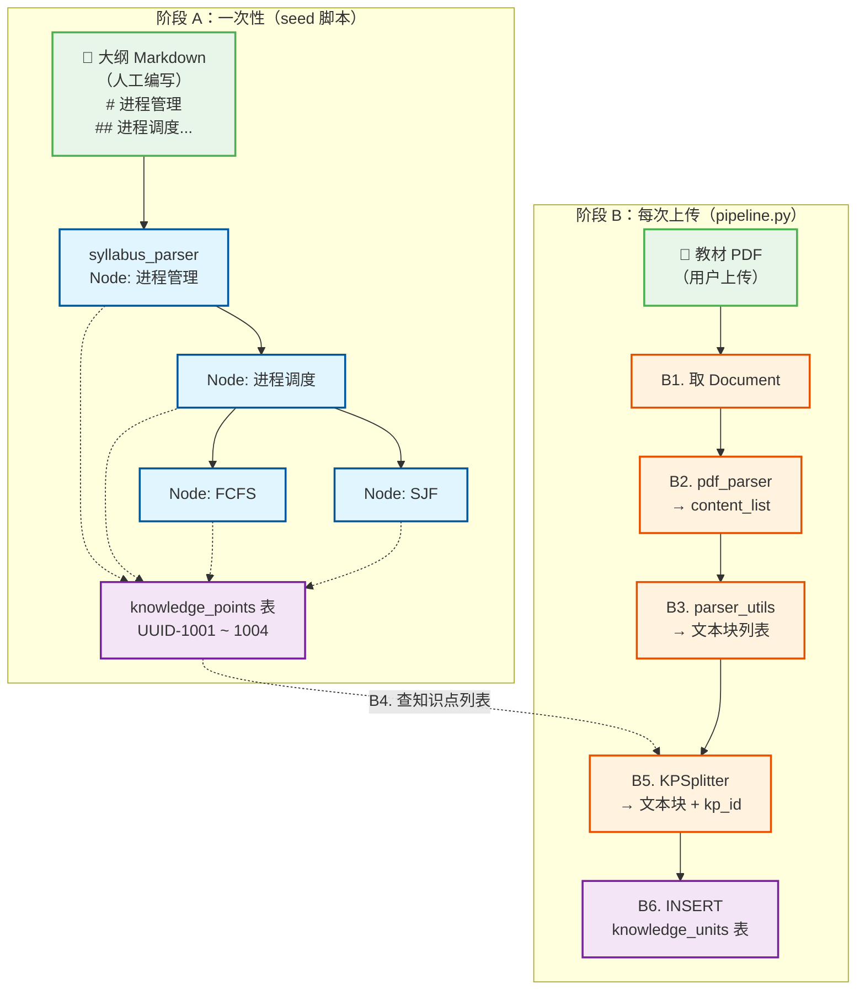

# Ingestion 流水线：从 PDF 到知识单元

> 最后更新：2026-06-17 | 覆盖范围：Week 1 ~ Week 2 | 后续扩展：Week 3 向量编码 + Week 4 评估

---

## 概览

整个流水线分两个阶段，在**不同时间**执行：

```
阶段 A（一次性，seed 脚本触发）          阶段 B（每次上传，pipeline.py 触发）
═══════════════════════════════         ═══════════════════════════════
手动编写的大纲 Markdown                  用户上传的教材 PDF/DOCX
       │                                        │
  syllabus_parser.py                      pdf_parser.py / docx_parser.py
       │                                        │
       ▼                                        ▼
  SyllabusNode 树                         content_list（原始结构化数据）
       │                                        │
  kp_tree.py                              parser_utils.extract_knowledge_units()
       │                                        │
       ▼                                        ▼
  knowledge_points 表 ──────────────────→ KPSplitter.assign()
  （知识点树，有 UUID）                         │
                                               ▼
                                      knowledge_units 表
                                      （文本块 + kp_id + page_ref）
```

**阶段 A 只在创建课程时执行一次**（通过 `scripts/seed_knowledge.py`）。阶段 B 在每次用户上传教材时执行（通过 `POST /courses/upload` → `pipeline.run_ingestion()`）。阶段 B 从 `knowledge_points` 表读取已建好的知识点树作为索引。

---

## 阶段 A：构建知识点树（一次性）

### 输入：人工编写的大纲 Markdown

放在 seed 脚本中，由课程负责人手动维护：

```markdown
# 进程管理
## 进程调度
### 先来先服务 FCFS
### 短作业优先 SJF
```

> 为什么是人工编写而非从 PDF 提取？大纲只有几十行，人工维护成本低且精确。一条错误的 `kp_path` 会导致整个知识点的检索失效——这部分必须由懂课的人把关。

### A1. `syllabus_parser.py` — 大纲文本 → 树节点

逐行扫描，`#` 数量 = 层级深度，用栈维护父子关系。

```json
// 输出（flatten 后的 SyllabusNode 列表，无数据库 UUID）
[
  {"title": "进程管理",       "level": 1, "kp_path": "OS/进程管理",                          "parent_title": null},
  {"title": "进程调度",       "level": 2, "kp_path": "OS/进程管理/进程调度",                   "parent_title": "进程管理"},
  {"title": "先来先服务 FCFS", "level": 3, "kp_path": "OS/进程管理/进程调度/先来先服务 FCFS",  "parent_title": "进程调度"},
  {"title": "短作业优先 SJF",  "level": 3, "kp_path": "OS/进程管理/进程调度/短作业优先 SJF",   "parent_title": "进程调度"}
]
```

**对应文件**：`src/coursepilot/knowledge/syllabus_parser.py`，核心类 `SyllabusParser`

### A2. `kp_tree.py` — 树节点 → PostgreSQL

逐节点 INSERT → `flush` 拿 UUID → 用 `parent_title` 回填 `parent_id`。

```json
// 输出（knowledge_points 表）
[
  {"id": "uuid-1001", "title": "进程管理",       "parent_id": null,         "kp_path": "OS/进程管理"},
  {"id": "uuid-1002", "title": "进程调度",       "parent_id": "uuid-1001",  "kp_path": "OS/进程管理/进程调度"},
  {"id": "uuid-1003", "title": "先来先服务 FCFS", "parent_id": "uuid-1002",  "kp_path": "OS/进程管理/进程调度/先来先服务 FCFS"},
  {"id": "uuid-1004", "title": "短作业优先 SJF",  "parent_id": "uuid-1002",  "kp_path": "OS/进程管理/进程调度/短作业优先 SJF"}
]
```

**对应文件**：`src/coursepilot/knowledge/kp_tree.py`，核心类 `KPTree`

> `kp_path` 上有唯一索引 `(course_id, kp_path)`。`parent_id` 设为 `ON DELETE CASCADE`。

---

## 阶段 B：处理上传文件（每次上传）

以下用一本《操作系统》教材 PDF 为例，模拟第 10~11 页的内容：

> §3.1 进程调度
> 先来先服务 (FCFS) 算法按照进程到达的先后顺序进行调度，非抢占式。
> §3.2 短作业优先
> 短作业优先 (SJF) 算法优先调度预计运行时间最短的进程。

### B1. 取 Document 记录

`pipeline.run_ingestion(session, document_id)` 的第一步：查出 Document，状态切为 `processing`。

### B2. 解析文件 — `pdf_parser.py` / `docx_parser.py`

根据 `doc.file_type` 选择解析器，统一输出 `content_list`。

```json
// 输出（content_list，原始结构化数据）
[
  {"type": "text", "text": "进程调度",           "text_level": 2, "page_idx": 9},
  {"type": "text", "text": "FCFS 算法按照作业到达的先后顺序进行调度，非抢占式。", "text_level": 99, "page_idx": 9},
  {"type": "text", "text": "短作业优先 SJF",    "text_level": 3, "page_idx": 10},
  {"type": "text", "text": "SJF 算法优先调度预计运行时间最短的作业。", "text_level": 99, "page_idx": 10}
]
```

`text_level ≤ 4` = 标题（PDF 中由字体大小推断，DOCX 中由 Heading 样式决定），`99` = 正文。

**对应文件**：`src/coursepilot/ingestion/pdf_parser.py`、`docx_parser.py`

### B3. 切分 — `parser_utils.extract_knowledge_units()`

`_split_by_headings()` 按标题边界切块 → `_split_text()` 按 token 数二次切分（带 overlap）→ `_format_page_ref()` 生成页码引用。

```json
// 输出（文本块列表，尚未关联知识点）
[
  {"content": "进程调度",           "meta_data": {"text_level": 2},  "page_ref": "p10", "seq_order": 1},
  {"content": "FCFS 算法按照作业到达的先后顺序进行调度，非抢占式。", "meta_data": {"text_level": 99}, "page_ref": "p10", "seq_order": 2},
  {"content": "短作业优先 SJF",    "meta_data": {"text_level": 3},  "page_ref": "p11", "seq_order": 3},
  {"content": "SJF 算法优先调度预计运行时间最短的作业。", "meta_data": {"text_level": 99}, "page_ref": "p11", "seq_order": 4}
]
```

**对应文件**：`src/coursepilot/ingestion/parser_utils.py`

### B4. 查知识点列表

从 `knowledge_points` 表查出该课程下已建好的所有知识点（阶段 A 的产物），作为 KPSplitter 的索引。

```sql
SELECT id, title, kp_path FROM knowledge_points WHERE course_id = :course_id
```

### B5. 分配 — `KPSplitter.assign()`

维护 `current_heading` 上下文。标题行 → 更新上下文 + 匹配 KP；正文行 → 用当前上下文匹配 KP。

匹配降级链：**精确匹配 → 去编号匹配 → 内容关键词匹配 → 兜底到根 KP**。

```json
// 输出（文本块 + kp_id + kp_path）
[
  {
    "content": "进程调度",
    "page_ref": "p10",
    "kp_id": "uuid-1002",    // 标题精确匹配 "进程调度"
    "kp_path": "OS/进程管理/进程调度"
  },
  {
    "content": "FCFS 算法按照作业到达的先后顺序进行调度，非抢占式。",
    "page_ref": "p10",
    "kp_id": "uuid-1003",    // 内容关键词包含 "FCFS"
    "kp_path": "OS/进程管理/进程调度/先来先服务 FCFS"
  },
  {
    "content": "短作业优先 SJF",
    "page_ref": "p11",
    "kp_id": "uuid-1004",    // 标题精确匹配 "短作业优先 SJF"
    "kp_path": "OS/进程管理/进程调度/短作业优先 SJF"
  },
  {
    "content": "SJF 算法优先调度预计运行时间最短的作业。",
    "page_ref": "p11",
    "kp_id": "uuid-1004",    // 内容关键词包含 "SJF"
    "kp_path": "OS/进程管理/进程调度/短作业优先 SJF"
  }
]
```

**对应文件**：`src/coursepilot/knowledge/kp_splitter.py`，核心类 `KPSplitter`

### B6. 入库 + 更新状态

批量 INSERT `knowledge_units`，Document 状态切为 `ready`。异常时切为 `failed` 并记录 `error_message`。

```
Document.status 状态机：
  pending → processing → ready   （成功）
                       → failed  （失败）
```

**对应文件**：`src/coursepilot/ingestion/pipeline.py`，核心函数 `run_ingestion(session, document_id)`

---

## `run_ingestion()` 完整代码流程

和上面 B1~B6 一一对应：

```python
async def run_ingestion(session: AsyncSession, document_id: str) -> None:
    # B1. 取 Document 记录
    doc = await session.get(Document, UUID(document_id))
    doc.status = "processing"
    await session.flush()

    try:
        # B2. 解析文件 → content_list
        if doc.file_type == "pdf":
            result = await parse_pdf(doc.file_path)
        elif doc.file_type == "docx":
            result = parse_docx(doc.file_path)
        elif doc.file_type == "md":
            result = _parse_markdown(doc.file_path)
        content_list = result["content_list"]

        # B3. 切分 → 文本块列表
        units = extract_knowledge_units(
            content_list,
            document_id=str(doc.id),
            kp_id="",  # 暂空，下一步 B5 分配
        )

        # B4. 查知识点列表（阶段 A 的产物）
        kp_result = await session.execute(
            select(KnowledgePoint).where(
                KnowledgePoint.course_id == doc.course_id
            )
        )
        kp_nodes = [
            {"id": str(kp.id), "title": kp.title,
             "kp_path": kp.kp_path, "level": _kp_level(kp.kp_path)}
            for kp in kp_result.scalars()
        ]

        # B5. 分配 kp_id
        if kp_nodes:
            splitter = KPSplitter(kp_nodes, str(doc.course_id))
            units = splitter.assign(units)

        # B6. 入库 knowledge_units + 更新状态
        for u in units:
            session.add(KnowledgeUnit(
                kp_id=UUID(u["kp_id"]) if u.get("kp_id") else None,
                document_id=doc.id,
                content=u["content"],
                seq_order=u.get("seq_order", 0),
                page_ref=u.get("page_ref", ""),
                meta_data=u.get("meta_data", {}),
            ))
        doc.status = "ready"

    except Exception as exc:
        doc.status = "failed"
        doc.error_message = str(exc)
        await session.flush()
        raise
```

---

## 全流程架构图



**两条虚线 = 阶段 A 和阶段 B 的唯一交汇点**：阶段 B 的步骤 B4 从 `knowledge_points` 表读取阶段 A 的产物，传给 `KPSplitter` 做匹配。

---

## 各步骤速查

| 阶段 | 步骤 | 文件 | 输入 | 输出 | 触发时机 |
| ---- | ---- | ---- | ---- | ---- | ---------- |
| A | A1 | `syllabus_parser.py` | 人工大纲 Markdown | `SyllabusNode` 列表 | seed 脚本 |
| A | A2 | `kp_tree.py` | A1 输出 | `knowledge_points` 行 | seed 脚本 |
| B | B1 | `pipeline.py` | `document_id` | Document 记录 | 每次上传 |
| B | B2 | `pdf_parser.py` / `docx_parser.py` | 教材文件 | `content_list` | B1 调用 |
| B | B3 | `parser_utils.py` | `content_list` | 文本块列表 | B2 调用 |
| B | B4 | —（SQL 查询） | — | 知识点列表 | B5 调用 |
| B | B5 | `kp_splitter.py` | B3 + B4 | 文本块 + `kp_id` + `kp_path` | B4 调用 |
| B | B6 | `pipeline.py` | B5 输出 | `knowledge_units` 行 | B5 调用 |

## 关键字段来源

| 字段 | 所属表 | 示例值 | 产生于 |
| ---- | ------ | ------ | ------ |
| `kp_path` | `knowledge_points` | `OS/进程管理/进程调度/FCFS` | 阶段 A1，`syllabus_parser` 按标题路径生成 |
| `parent_id` | `knowledge_points` | `uuid-1002` | 阶段 A2，`kp_tree` 入库时回填 |
| `text_level` | 内存 `meta_data` | `2` / `99` | 阶段 B2，PDF 字体大小或 DOCX Heading 样式 |
| `page_ref` | `knowledge_units` | `p10` | 阶段 B3，`parser_utils._format_page_ref()` |
| `kp_id` | `knowledge_units` | `uuid-1003` | 阶段 B5，`KPSplitter` 匹配后分配 |

## 后续扩展（Week 3 ~ Week 4）

| 周次 | 扩展内容 | 插入位置 |
|------|----------|----------|
| Week 3 | bge-m3 稠密编码 → Milvus | 阶段 B6 INSERT 后追加 |
| Week 3 | BM25 稀疏索引 | 阶段 B6 INSERT 后追加 |
| Week 4 | RAGAS 评估 | 新增 `evaluation/rag_eval.py` |
| Week 4 | LLM 语义匹配升级 | 替换 B5 的 `_match_content()` |
